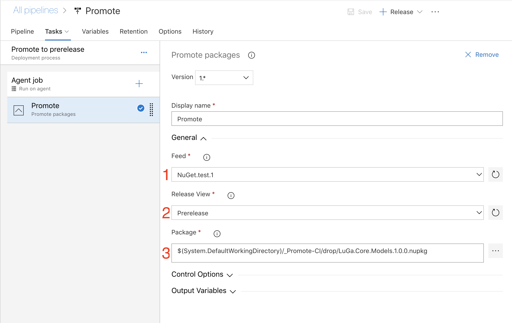

# Promote

Promote packages on VSTS  

[Changes](./CHANGELOG.md)  

## About

Supported feed types:

* NuGet
* NPM  
* Python

## Usage

Pre-conditions:  

1) Package must be apart of the artifacts of the task group.

Steps

1) Select the feed, at the moment only NuGet is supported.
2) Select the view to promote to.  
3) Select the package path  


## Build

```bash
npm run-script build
```

###

```bash
npm test
```